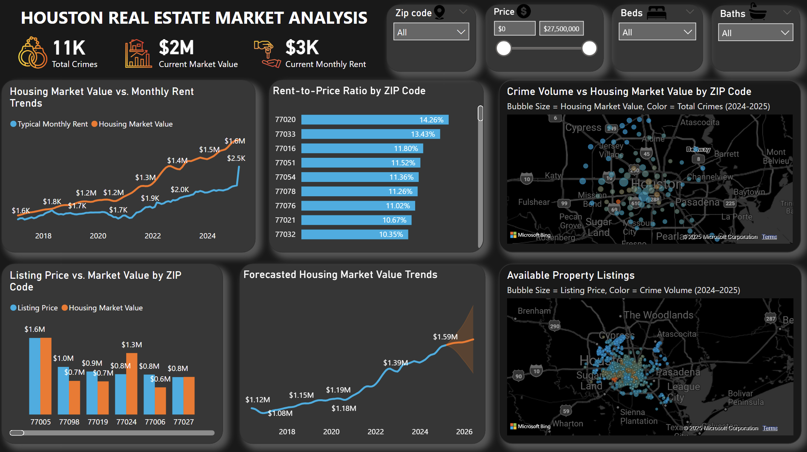

# Houston Real Estate Market Analysis Dashboard



This project presents a comprehensive Power BI dashboard analyzing housing trends, rent prices, crime volume, and listing data across ZIP codes in Houston, Texas. The dashboard enables users to explore correlations between housing market value, monthly rents, crime levels, and listing prices to aid data-driven decisions for renters, buyers, and investors. The goal is to help renters, buyers, and investors make informed decisions by combining housing prices, rental trends, and crime data in a unified interactive dashboard.

---

## Table of Contents
- [Overview](#overview)
- [Data Sources](#data-sources)
- [Data Availability](#data-availability)
- [Tools & Technologies](#tools--technologies)
- [Folder Structure](#folder-structure)
- [Key Features](#key-features)
- [Setup and Usage](#setup-and-usage)
- [License](#license)

---

## Overview

The dashboard integrates multiple datasets to provide:
- Time-series trends for home values (ZHVI) and rent values (ZORI)
- Rent-to-price ratio comparisons by ZIP code
- Forecasted housing value projections
- Crime volume mapping
- Visual comparison of listing price vs. market value
- Interactive ZIP, price, beds, and baths filters

It supports insight discovery for:
- Affordability and investment potential
- High-crime or low-value areas
- Identifying ZIPs with high rental yield


The dashboard answers key questions such as:

- Which ZIP codes in Houston offer the highest rental yield (Rent-to-Price Ratio)?
- How have property values and rents changed over time?
- Which areas show high property listings with low crime rates?
- How do home values compare with actual listing prices?

---

## Data Sources

1. **Zillow Housing and Rent Data**  
   - ZHVI (Zillow Home Value Index)  
   - ZORI (Zillow Observed Rent Index)  
   - Source: [Zillow Research Data](https://www.zillow.com/research/data/) (official source)


2. **Crime Data**  
   - Source: [Houston Police Department](https://www.houstontx.gov/police/cs/Monthly_Crime_Data_by_Street_and_Police_Beat.htm) (official source)


3. **Real Estate Listings**
   - Scraped from Redfin
   - Python script used to generate `property_listings.csv`

---

## Data Availability

This repository does **not** include raw or cleaned data files (`raw_data/` and `cleaned_data/`) because of size limitations.  
To reproduce the dashboard:

1. **Zillow Housing and Rent Data**  
   Download ZHVI and ZORI data from [Zillow Research Data](https://www.zillow.com/research/data/).  

2. **Crime Data**  
   Download monthly crime data from the [Houston Police Department](https://www.houstontx.gov/police/cs/Monthly_Crime_Data_by_Street_and_Police_Beat.htm).  

3. **Real Estate Listings**  
   Run the `redfin scraper/redfin.py` script to generate `property_listings.csv`.

Once downloaded/generated:
- Place all raw files in the `raw_data/` folder.  
- Run preprocessing scripts (`preprocessing/rentals.ipynb`) to generate cleaned CSVs in `cleaned_data/`.  
- Use these cleaned files when loading into PostgreSQL and connecting Power BI.

---

## Tools & Technologies

- **Power BI**: Data visualization and dashboard design
- **PostgreSQL**: Data storage, views, and SQL-based querying
- **Python**: Data scraping and preprocessing (Redfin and CSV cleaning)
- **Google Colab**: Data exploration and cleaning in Jupyter Notebook
- **GitHub**: Version control and project organization

---
## Folder Structure

```bash
houston-housing-dashboard/
│
├── assets/
│   └── housing_dashboard.png              # Dashboard screenshot
│
├── cleaned_data/
│   ├── crime_2024_clean.csv
│   ├── crime_2025_clean.csv
│   ├── property_listings_clean.csv
│   ├── zhvi_clean.csv
│   ├── zori_clean.csv
│   └── zori1_clean.csv
│
├── dashboard/
│   └── houston real estate.pbix           # Power BI dashboard file
│
├── preprocessing/
│   └── rentals.ipynb                      # Google Colab notebook for preprocessing
│
├── raw_data/
│   ├── property_listings.csv
│   ├── zhvi_raw.csv
│   ├── zori_raw.csv
│   ├── zori1_raw.csv
│   ├── crime_2024_raw.xlsx
│   └── crime_2025_raw.xlsx
│
├── redfin scraper/
│   └── redfin.py                          # Python script to scrape Redfin listings
│
├── sql/
│   ├── create_tables.sql
│   └── create_views.sql
│
└── README.md
```
---
## Key Features

### KPIs

- **Total Crimes**
- **Current Market Value**
- **Current Monthly Rent**

### Visualizations

- **Housing Value vs. Rent Trends**  
  Shows the growth of home values and rent across time.

- **Rent-to-Price Ratio by ZIP Code**  
  Highlights ZIP codes with higher rental yield.

- **Forecasted Housing Market Trends**  
  Shows Zillow's projected home values.

- **Listing Price vs. Market Value**  
  Compares scraped Redfin listing prices with ZHVI per ZIP.

- **Crime Volume Map**  
  Bubble map showing crime count vs. home value by ZIP.

- **Available Property Listings**  
  Geographic map of scraped listings colored by crime volume.

---

## Setup and Usage

1. Clone this repository.
2. Run `redfin.py` located in the `redfin scraper/` folder to generate the latest `property_listings.csv`.
3. Open `rentals.ipynb` from the `preprocessing/` folder in Google Colab or Jupyter Notebook to clean and preprocess:
   - Zillow housing and rent data
   - Redfin property listings
   - Crime data from 2024 and 2025
   - Save cleaned outputs to the `cleaned_data/` folder
4. Execute `create_tables.sql` and `create_views.sql` from the `sql/` folder in a PostgreSQL database to load and model the data.
5. Open `houston real estate.pbix` from the `dashboard/` folder in Power BI Desktop.
6. Connect your Power BI file to the PostgreSQL database containing the cleaned data and views.
7. Interact with the dashboard using slicers for ZIP code, price, beds, and baths, and explore trends and patterns across visualizations.


---

## License

This project is licensed under the MIT License.

---